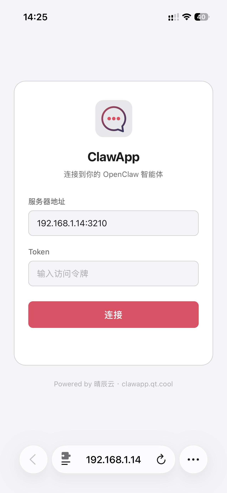
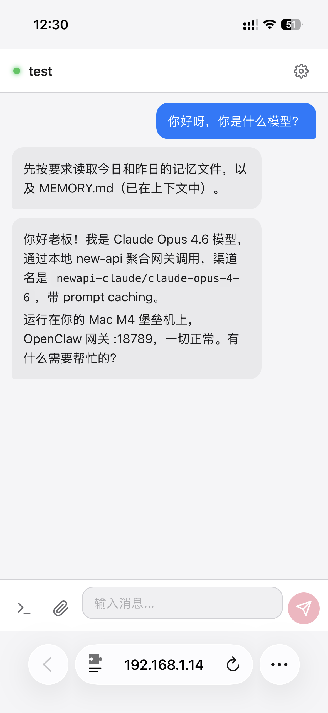
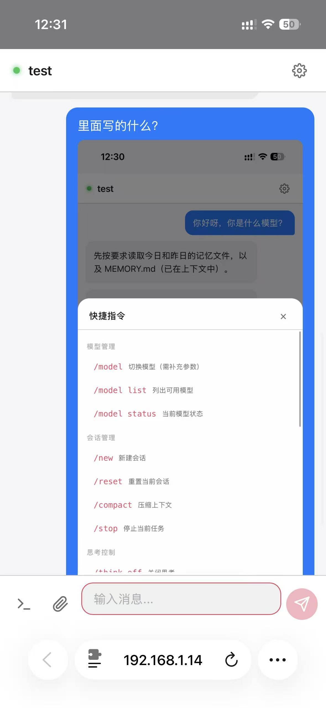
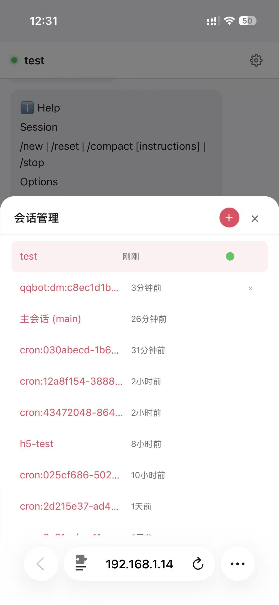
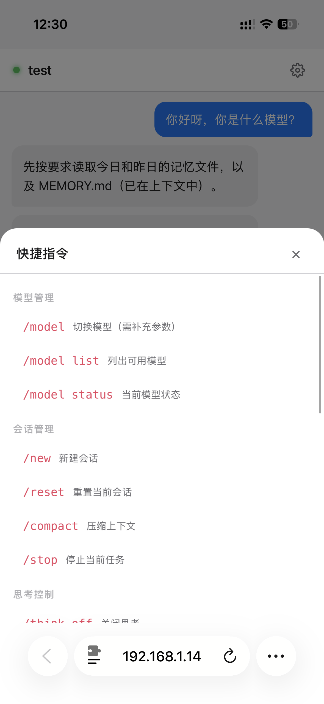
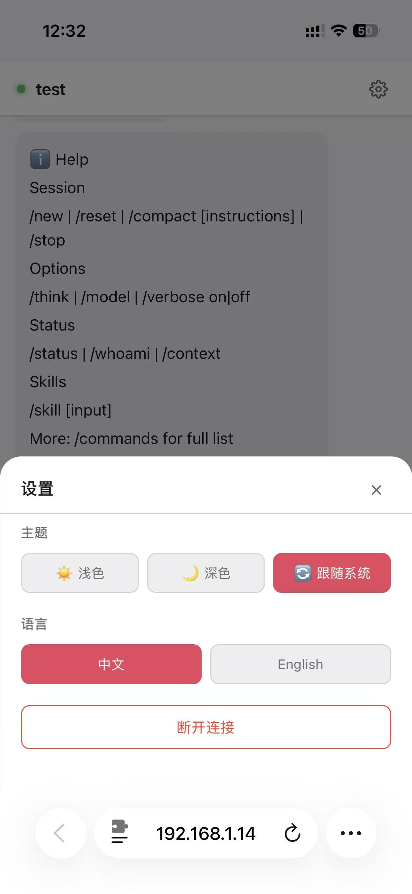

# ClawApp

<p align="center">
  <strong>📱 用手机浏览器和你的 OpenClaw AI 智能体聊天</strong>
</p>

<p align="center">
  <a href="#features">功能特性</a> •
  <a href="#screenshots">截图预览</a> •
  <a href="#quickstart">快速开始</a> •
  <a href="#deploy">部署方式</a> •
  <a href="#remote">外网访问</a> •
  <a href="#config">配置参数</a> •
  <a href="#faq">常见问题</a> •
  <a href="#community">社区交流</a> •
  <a href="#english">English</a>
</p>

<p align="center">
  <a href="https://clawapp.qt.cool">🌐 产品主页</a> •
  <a href="https://github.com/1186258278/OpenClawChineseTranslation">🇨🇳 OpenClaw 中文汉化版</a> •
  <a href="https://discord.gg/U9AttmsNHh">💬 Discord</a> •
  <a href="https://yb.tencent.com/gp/i/LsvIw7mdR7Lb">🤖 元宝派</a> •
  <a href="https://qt.cool/c/OpenClaw">💬 QQ 群</a> •
  <a href="https://qt.cool/c/OpenClawWx">💬 微信群</a> •
  <a href="https://qt.cool/c/feishu">💬 飞书群</a>
</p>

---

> 🦀 **[ClawPanel](https://github.com/qingchencloud/clawpanel)** — 内置 AI 助手的 OpenClaw 可视化管理面板（桌面端） | 🇨🇳 **[OpenClaw 汉化版](https://github.com/1186258278/OpenClawChineseTranslation)** — 全中文 CLI + Dashboard

---

<h2 id="about">这是什么？</h2>

[OpenClaw](https://github.com/openclaw/openclaw) 是一个强大的 AI 智能体平台（[中文汉化版](https://github.com/1186258278/OpenClawChineseTranslation)），但它的 Gateway 默认只监听本机（`127.0.0.1:18789`），手机无法直接连接。

ClawApp 解决了这个问题：

```
手机浏览器（任意网络）
    ↓ WebSocket (WS / WSS)
代理服务端（ClawApp Server，端口 3210，离线缓存）
    ↓ WebSocket + Ed25519 设备签名
OpenClaw Gateway（端口 18789）
```

代理服务端自动完成 Ed25519 设备签名握手认证（兼容 OpenClaw 2.13+），同时提供 H5 聊天页面，打开就能用，不需要装 App。

---

<h2 id="features">功能特性</h2>

- 💬 实时流式聊天（打字机效果）
- 📷 图片收发（拍照/相册上传，AI 图片回复）
- 📝 Markdown 渲染 + 代码高亮（XSS 防护）
- ⚡ 快捷指令面板（/model、/think、/new 等）
- 🔧 工具调用实时状态显示
- 🎤 语音输入（语音转文字，需 HTTPS 环境）
- 🤖 多智能体支持（新建会话时可选择不同 Agent）
- 📋 会话管理（切换、新建、删除）
- 🌙 主题切换（亮色 / 暗色 / 跟随系统）
- 🌐 中英文切换
- 🔄 智能重连（断线自动恢复，无闪烁，消息去重）
- 🔒 Token / Password + Ed25519 设备认证（兼容 OpenClaw 2.13+，支持 Tailscale Funnel 密码模式）
- 💾 离线消息缓存（IndexedDB 持久化，断网可查看历史，恢复后自动同步）
- 👋 新用户功能引导
- 📱 PWA 支持（添加到主屏幕，离线可用）
- 📦 Android APK 打包（Capacitor + GitHub Actions 自动构建）

---

<h2 id="screenshots">截图预览</h2>

<table align="center">
  <tr>
    <td align="center"><br/><sub>登录连接</sub></td>
    <td align="center"><br/><sub>流式聊天</sub></td>
    <td align="center"><br/><sub>快捷指令</sub></td>
  </tr>
  <tr>
    <td align="center"><br/><sub>会话管理</sub></td>
    <td align="center"><br/><sub>指令面板</sub></td>
    <td align="center"><br/><sub>设置与帮助</sub></td>
  </tr>
</table>

---

<h2 id="quickstart">快速开始</h2>

### 一键部署（Mac / Linux）

```bash
curl -fsSL https://raw.githubusercontent.com/qingchencloud/clawapp/main/install.sh | bash
```

### 一键部署（Windows PowerShell）

```powershell
irm https://raw.githubusercontent.com/qingchencloud/clawapp/main/install.ps1 | iex
```

脚本会自动检测环境、克隆仓库、安装依赖、构建前端、交互式配置 Token，并支持 PM2 常驻运行。如果本地已安装 OpenClaw，会自动读取 Gateway Token。

### 前提条件

- 电脑上已运行 [OpenClaw](https://github.com/openclaw/openclaw) Gateway（默认端口 18789）
  - 推荐使用 [中文汉化版](https://github.com/1186258278/OpenClawChineseTranslation)
- 安装了 [Node.js](https://nodejs.org/) 18+ 或 [Docker](https://www.docker.com/)

### 方式一：Docker 部署（推荐）

```bash
git clone https://github.com/qingchencloud/clawapp.git
cd clawapp
```

在项目根目录创建 `.env` 文件：

```bash
# 手机连接时的密码（自己设一个）
PROXY_TOKEN=my-secret-token-123

# OpenClaw Gateway 的 Token（在 ~/.openclaw/gateway.yaml 里找）
OPENCLAW_GATEWAY_TOKEN=你的gateway-token

# 或者使用密码认证（Tailscale Funnel 场景必须用 password 模式）
# 设置后自动切换为 password 认证，优先级高于 token
# OPENCLAW_GATEWAY_PASSWORD=你的gateway-password
```

启动：

```bash
docker compose up -d --build
```

### 方式二：直接运行

```bash
git clone https://github.com/qingchencloud/clawapp.git
cd clawapp
npm run install:all
npm run build:h5
cp server/.env.example server/.env
# 编辑 server/.env，填入你的 token
npm start
```

### 手机访问

1. 确保手机和电脑在同一 WiFi
2. 查看电脑 IP：
   - Mac: `ifconfig | grep "inet " | grep -v 127.0.0.1`
   - Windows: `ipconfig`
   - Linux: `ip addr`
3. 手机浏览器打开 `http://你的电脑IP:3210`
4. 填入服务器地址和 Token，点击连接

---

<h2 id="deploy">部署方式</h2>

### 本地部署（同一网络）

适合家庭/办公室使用，手机和电脑在同一 WiFi 下。

```bash
git clone https://github.com/qingchencloud/clawapp.git
cd clawapp && npm run install:all
npm run build:h5
cp server/.env.example server/.env
# 编辑 server/.env 填入 token
npm start
```

### Docker 容器部署

```bash
# 创建 .env
cat > .env << 'EOF'
PROXY_TOKEN=my-token-123
OPENCLAW_GATEWAY_TOKEN=你的gateway-token
ALLOWED_ORIGINS=
EOF

# 构建并启动
docker compose up -d --build

# 查看日志
docker compose logs -f
```

Docker 环境下会自动使用 `host.docker.internal` 连接宿主机的 Gateway。

### 使用 PM2 常驻运行

```bash
# 安装 pm2
npm install -g pm2

# 启动
pm2 start server/index.js --name clawapp

# 开机自启
pm2 save && pm2 startup
```

---

<h2 id="remote">外网访问</h2>

不在同一网络时，有以下方案：

### 方案一：cftunnel（推荐，一条命令搞定）

[cftunnel](https://github.com/qingchencloud/cftunnel) 是 Cloudflare Tunnel 一键管理 CLI，免费、自动 HTTPS、无需公网 IP。

> 💡 **为什么推荐 cftunnel？** 浏览器的语音输入（🎤）功能要求 HTTPS 安全上下文，局域网 HTTP 访问无法使用麦克风。cftunnel 自动提供 HTTPS，一条命令即可解锁语音输入等高级功能。

**临时分享（零配置）：**

```bash
# 安装 cftunnel
curl -fsSL https://raw.githubusercontent.com/qingchencloud/cftunnel/main/install.sh | bash

# 一条命令穿透
cftunnel quick 3210
# ✔ 隧道已启动: https://xxx-yyy-zzz.trycloudflare.com
```

**固定域名（需要 Cloudflare 账号 + 自有域名）：**

```bash
cftunnel init                                          # 配置 CF API Token
cftunnel create my-tunnel                              # 创建隧道
cftunnel add clawapp 3210 --domain chat.example.com    # 添加路由（自动创建 DNS）
cftunnel up                                            # 启动
cftunnel install                                       # 注册开机自启
```

> 详见 [cftunnel 文档](https://cftunnel.qt.cool) · 也有 [桌面客户端](https://github.com/qingchencloud/cftunnel-app) 可视化管理

### 方案二：SSH 隧道（简单快速）

需要一台有公网 IP 的服务器。

```bash
# 在你的电脑上执行
ssh -f -N \
  -o ServerAliveInterval=15 \
  -o ServerAliveCountMax=4 \
  -R 0.0.0.0:3210:127.0.0.1:3210 \
  user@你的服务器IP
```

> ⚠️ 服务器需要：
> - `/etc/ssh/sshd_config` 中设置 `GatewayPorts yes`
> - 防火墙放行 3210 端口

手机访问 `http://服务器IP:3210`

> ⚠️ SSH 隧道默认是 HTTP，语音输入功能不可用。如需语音输入，请配合 Nginx SSL 或改用 cftunnel。

### 方案三：Nginx 反向代理

```nginx
server {
    listen 443 ssl;
    server_name clawapp.你的域名.com;

    ssl_certificate /path/to/cert.pem;
    ssl_certificate_key /path/to/key.pem;

    location / {
        proxy_pass http://127.0.0.1:3210;
        proxy_http_version 1.1;
        proxy_set_header Upgrade $http_upgrade;
        proxy_set_header Connection "upgrade";
        proxy_set_header Host $host;
        proxy_read_timeout 86400;
    }
}
```

### 方案对比

| 方案 | 优点 | 缺点 |
|------|------|------|
| **cftunnel（推荐）** | **一条命令，免费，自动 HTTPS，开机自启** | **依赖 Cloudflare 服务** |
| SSH 隧道 | 简单，无需额外软件 | 需要公网服务器，隧道可能断开 |
| Nginx 反代 | 完全可控，自定义域名 | 需要服务器 + SSL 配置 |
| Tailscale/ZeroTier | P2P 直连，加密 | 手机也要装客户端 |

---

<h2 id="connection">连接说明</h2>

打开 H5 页面后会看到连接设置页，需要填写两个字段：

### 服务器地址

填写运行 ClawApp Server 的电脑 IP 和端口。

**局域网访问**（手机和电脑同一 WiFi）：
```bash
# 查看电脑 IP
# Mac
ifconfig | grep "inet " | grep -v 127.0.0.1
# Windows
ipconfig
# Linux
ip addr
```
然后在 App 中填入 `你的电脑IP:3210`，例如 `192.168.1.100:3210`

**外网访问**：填入公网地址，例如 `你的服务器IP:3210` 或 cftunnel 生成的域名 `xxx-yyy.trycloudflare.com`

**本机访问**：直接填 `localhost:3210`

### Token 获取

App 登录页的 Token 是你在部署时自己设置的 `PROXY_TOKEN`，相当于访问密码。

#### 1. 如果用一键脚本部署

脚本会交互式引导你设置 Token，设置完后记住即可。如果忘了，查看配置文件：
```bash
cat server/.env | grep PROXY_TOKEN
```

#### 2. 如果手动部署 / Docker 部署

Token 在 `.env`（Docker）或 `server/.env`（手动部署）文件中配置：

```bash
# 这个是 App 登录密码，自己随便设一个
PROXY_TOKEN=my-secret-token-123

# 这个是 OpenClaw Gateway 的认证 Token（见下方获取方式）
OPENCLAW_GATEWAY_TOKEN=你的gateway-token
```

`PROXY_TOKEN` 是你自己定义的密码，设什么 App 里就填什么。

#### 3. OPENCLAW_GATEWAY_TOKEN 怎么获取

这个 Token 在 OpenClaw 的配置文件 `~/.openclaw/openclaw.json` 中（JSON5 格式）：

```bash
# 查看 Gateway Token
cat ~/.openclaw/openclaw.json | grep token
```

在配置文件中找到类似这样的结构：
```json5
{
  gateway: {
    port: 18789,
    auth: {
      mode: "token",
      token: "你的-gateway-token"  // ← 复制这个值
    }
  }
}
```

把 `gateway.auth.token` 的值复制到 `.env` 的 `OPENCLAW_GATEWAY_TOKEN` 中即可。

#### 4. 使用密码认证（Tailscale Funnel 场景）

如果你的 Gateway 使用 `password` 模式（例如通过 Tailscale Funnel 暴露），需要用 `OPENCLAW_GATEWAY_PASSWORD` 代替 Token：

```json5
// ~/.openclaw/openclaw.json
{
  gateway: {
    auth: {
      mode: "password",
      password: "你的-gateway-password"  // ← 复制这个值
    }
  }
}
```

在 `server/.env` 中设置：
```bash
# 密码认证（设置后自动优先于 token）
OPENCLAW_GATEWAY_PASSWORD=你的-gateway-password
```

> 💡 `OPENCLAW_GATEWAY_PASSWORD` 和 `OPENCLAW_GATEWAY_TOKEN` 二选一。设置了 password 后会自动使用密码模式，优先级高于 token。

> 💡 `PROXY_TOKEN`（App 登录密码）和 `OPENCLAW_GATEWAY_TOKEN`/`OPENCLAW_GATEWAY_PASSWORD`（Gateway 认证）是两个不同的概念。前者自己设，后者从 OpenClaw 配置中获取。

> 💡 通过 HTTPS 访问时（如 Cloudflare Tunnel），WebSocket 会自动切换为 WSS 加密连接。

### H5 客户端设置

点击聊天页右上角 ⚙️ 图标：

- **主题**：浅色 / 深色 / 跟随系统
- **语言**：中文 / English
- **断开连接**：返回连接页

---

<h2 id="config">配置参数</h2>

| 变量 | 必填 | 默认值 | 说明 |
|------|------|--------|------|
| `PROXY_PORT` | 否 | `3210` | 代理服务端端口 |
| `PROXY_TOKEN` | **是** | - | H5 客户端连接密码 |
| `OPENCLAW_GATEWAY_URL` | 否 | `ws://127.0.0.1:18789` | Gateway 地址（Docker 下自动设为 `host.docker.internal`） |
| `OPENCLAW_GATEWAY_TOKEN` | 二选一 | - | Gateway 认证 token |
| `OPENCLAW_GATEWAY_PASSWORD` | 二选一 | - | Gateway 密码认证（Tailscale Funnel 场景，优先级高于 token） |
| `MEDIA_ALLOW_ALL` | 否 | `0` | 设为 `1` 允许访问任意路径的媒体文件（默认仅 `/tmp/` 和 `/var/folders/`） |
| `ALLOWED_ORIGINS` | 否 | - | 额外 CORS 白名单，逗号分隔 |

---

<h2 id="structure">项目结构</h2>

```
clawapp/
├── server/                # WebSocket 代理服务端
│   ├── index.js           # Express + WS 代理 + Gateway 握手
│   ├── package.json
│   ├── Dockerfile
│   └── .env.example
├── h5/                    # H5 移动端前端
│   ├── src/
│   │   ├── main.js        # 入口 + 连接页
│   │   ├── ws-client.js   # WebSocket 协议层
│   │   ├── chat-ui.js     # 聊天 UI
│   │   ├── session-picker.js # 会话选择器（切换/新建/删除）
│   │   ├── message-db.js  # IndexedDB 离线消息存储
│   │   ├── offline-queue.js # 离线队列 + 增量同步
│   │   ├── commands.js    # 快捷指令面板
│   │   ├── markdown.js    # Markdown 渲染 + 代码高亮
│   │   ├── media.js       # 图片处理
│   │   ├── i18n.js        # 国际化（中文 / English）
│   │   ├── theme.js       # 主题管理（亮/暗/自动）
│   │   ├── settings.js    # 设置面板
│   │   ├── style.css      # 主样式 + 主题变量
│   │   └── components.css # 组件样式
│   ├── index.html
│   └── vite.config.js
├── android/               # Capacitor Android 项目
├── .github/workflows/     # GitHub Actions
│   └── build-apk.yml      # 自动构建 APK
├── docs/                  # 文档 + GitHub Pages
│   ├── index.html         # 产品落地页
│   ├── pwa-and-apk-guide.md  # PWA/APK 打包指南
│   └── image/             # 截图
├── capacitor.config.ts    # Capacitor 配置
├── Dockerfile             # 多阶段构建
├── docker-compose.yml     # 生产部署
└── README.md
```

---

<h2 id="dev">开发</h2>

```bash
# 安装依赖
npm run install:all

# H5 开发服务器（热更新，端口 5173）
npm run dev:h5

# 代理服务端（端口 3210）
npm run dev:server
```

---

<h2 id="faq">常见问题</h2>

**Q: 一直显示「连接中」或报 502 Bad Gateway 错误？**

1. 检查 OpenClaw Gateway 是否在运行：`curl http://localhost:18789`
2. 后台日志如果提示 `Gateway 握手失败: NOT_PAIRED` 或 `pairing required`，是因为根据 OpenClaw 的安全机制，首次连接需要作为设备进行配对审批。**请在运行 Gateway 的服务端执行以下命令批准配对：**
   ```bash
   # 查看待配对设备列表并获取 requestId
   openclaw gateway call device.pair.list --json
   # 使用 requestId 批准配对
   openclaw gateway call device.pair.approve --params '{"requestId":"<你的id>"}' --json
   ```
3. 确认 `OPENCLAW_GATEWAY_TOKEN` 正确
4. Docker 部署时，Gateway 地址应为 `ws://host.docker.internal:18789`

**Q: 手机打不开页面？**

1. 手机和电脑是否在同一 WiFi？
2. 电脑防火墙是否放行了 3210 端口？
3. 地址是否用了电脑 IP（不是 localhost）？

**Q: WebSocket 经常断开？**

服务端内置 30 秒心跳保活，客户端也有 25 秒应用层心跳。如果还是断，检查反向代理的超时配置（建议 > 60s）。SSH 隧道建议加 `-o ServerAliveInterval=15`。

**Q: 能多人同时使用吗？**

可以。每个连接创建独立的 Gateway 会话，但共享同一个 OpenClaw 实例。

**Q: 怎么添加更多语言？**

编辑 `h5/src/i18n.js`，添加新的语言包（如 `'ja'`），然后在 `settings.js` 中添加对应按钮。

**Q: 语音输入按钮点了没反应？**

浏览器要求 HTTPS 才能使用麦克风。局域网 HTTP 访问时，语音按钮会提示需要 HTTPS。解决方案：使用 `cftunnel quick 3210` 一键开启 HTTPS 隧道，详见[外网访问](#remote)。

**Q: Docker 构建时 npm install 超时失败？**

国内网络拉取 npm 包可能很慢，有几种解决方案：

1. 在 Dockerfile 的 `RUN npm install` 前加镜像源：
   ```dockerfile
   RUN npm config set registry https://registry.npmmirror.com && npm install --omit=dev
   ```
2. 或者跳过 Docker，直接本地运行（推荐网络不好时使用）：
   ```bash
   npm run install:all && npm run build:h5
   cp server/.env.example server/.env  # 编辑填入 token
   npm start
   ```

**Q: 启动时报 EADDRINUSE 端口被占用？**

说明 3210 端口已被其他进程占用。常见原因：

1. 之前用 PM2 启动过：`pm2 stop openclaw-mobile && pm2 delete openclaw-mobile`
2. 之前用 nohup 启动过：`lsof -i:3210 -t | xargs kill -9`
3. Docker 容器还在跑：`docker compose down`

确认端口释放后再启动：`lsof -i:3210 || echo "端口可用"`

**Q: 用 PM2 管理时不断重启？**

PM2 会在进程崩溃时自动重启。如果 Gateway 没运行或 Token 错误，服务会启动后立即因连接失败而退出，导致循环重启。解决：

1. 先确认 Gateway 在运行：`curl http://localhost:18789`
2. 检查 `server/.env` 中的 Token 是否正确
3. 查看 PM2 日志定位问题：`pm2 logs openclaw-mobile --lines 30`

**Q: 不需要修改 OpenClaw 就能用吗？**

是的。ClawApp 完全兼容原生 OpenClaw，不需要安装插件、不需要改配置、不需要开额外端口。只要 Gateway 在运行（默认 `127.0.0.1:18789`），把 Token 填到 `.env` 里就能用。

**Q: 部署到远程服务器后访问不了？**

1. 确认防火墙放行了 3210 端口：
   ```bash
   # Ubuntu/Debian
   sudo ufw allow 3210/tcp
   # CentOS/RHEL
   sudo firewall-cmd --add-port=3210/tcp --permanent && sudo firewall-cmd --reload
   ```
2. 云服务器还需要在控制台安全组中放行 3210 端口
3. 确认服务在监听：`ss -tlnp | grep 3210`
4. 注意：远程服务器上也需要运行 OpenClaw Gateway，否则页面能打开但无法聊天

**Q: 一键脚本安装的 Node.js (nvm) 在 PM2 重启后找不到？**

nvm 安装的 Node.js 需要 source 才能生效。如果 PM2 通过 `pm2 startup` 设置了开机自启，重启后可能找不到 node。解决：

```bash
# 获取 node 的绝对路径
which node  # 例如 /root/.nvm/versions/node/v22.22.0/bin/node

# 用绝对路径启动 PM2
pm2 startup
pm2 save
```

或者将 nvm 的 node 软链到系统路径：
```bash
sudo ln -sf $(which node) /usr/local/bin/node
sudo ln -sf $(which npm) /usr/local/bin/npm
sudo ln -sf $(which pm2) /usr/local/bin/pm2
```

**Q: 能部署到没有 OpenClaw 的服务器上吗？**

可以部署，但需要通过 SSH 隧道或反向代理将远程服务器的请求转发回运行 OpenClaw 的电脑。典型场景：

```
手机 → 远程服务器 ClawApp(:3210) → SSH隧道 → 本地电脑 Gateway(:18789)
```

在远程服务器上：
```bash
# 将远程的 18789 端口转发到本地电脑的 Gateway
ssh -f -N -L 127.0.0.1:18789:127.0.0.1:18789 user@你的电脑IP
```

这样远程 ClawApp 就能通过 `ws://127.0.0.1:18789` 连接到你本地的 Gateway。

---

<h2 id="security">安全建议</h2>

- 务必设置强 `PROXY_TOKEN`（建议 32 位以上随机字符串）
  ```bash
  openssl rand -hex 24
  ```
- Gateway Token 只在服务端 `.env` 中，不会暴露给客户端
- 公网访问建议使用 HTTPS（Cloudflare Tunnel 或 Nginx + SSL）
- 可选：使用 [Cloudflare Access](https://www.cloudflare.com/products/zero-trust/) 添加额外认证
- 部署到公网服务器时，务必设置防火墙规则，只开放必要端口（3210）
- 不要将 `.env` 文件提交到 Git（已在 `.gitignore` 中排除）

---

<h2 id="related">相关项目</h2>

- [OpenClaw](https://github.com/openclaw/openclaw) - AI 智能体平台
- [OpenClaw 中文汉化版](https://github.com/1186258278/OpenClawChineseTranslation) - 社区汉化
- [cftunnel](https://github.com/qingchencloud/cftunnel) - Cloudflare Tunnel 一键管理 CLI（推荐用于外网访问）
- [cftunnel-app](https://github.com/qingchencloud/cftunnel-app) - cftunnel 桌面客户端

---

<h2 id="community">社区交流</h2>

欢迎加入社区，交流使用心得、反馈问题、获取最新动态：

<p align="center">
  <a href="https://discord.gg/U9AttmsNHh"></a>
  &nbsp;
  <a href="https://yb.tencent.com/gp/i/LsvIw7mdR7Lb"></a>
  &nbsp;
  <a href="https://qt.cool/c/OpenClaw"></a>
  &nbsp;
  <a href="https://qt.cool/c/OpenClawWx"></a>
  &nbsp;
  <a href="https://qt.cool/c/feishu"></a>
</p>

### QQ 交流群

<p align="center">
    
</p>
<p align="center">
  <em>扫码或 <a href="https://qt.cool/c/OpenClaw">点击链接</a> 加入 | 2000 人大群，满员自动切换</em>
</p>

### 微信交流群

<p align="center">
  <a href="https://qt.cool/c/OpenClawWx">
    
  </a>
</p>
<p align="center">
  <em>扫码或 <a href="https://qt.cool/c/OpenClawWx">点击链接</a> 加入 | 碰到问题也可以直接在群内反馈</em>
</p>

### 飞书交流群

<p align="center">
  <a href="https://qt.cool/c/feishu">
    
  </a>
</p>
<p align="center">
  <em>扫码或 <a href="https://qt.cool/c/feishu">点击链接</a> 加入 | 飞书群聊，高效协作交流</em>
</p>

- 🎮 [Discord 社区](https://discord.gg/U9AttmsNHh) — 国际交流频道
- 🤖 [元宝派社群圈子](https://yb.tencent.com/gp/i/LsvIw7mdR7Lb) — 腾讯元宝派讨论区

---

<details id="english">
<summary><strong>English Documentation</strong></summary>

### What is this?

ClawApp is an H5 mobile chat client that lets you chat with your [OpenClaw](https://github.com/openclaw/openclaw) AI agent from any phone browser.

### Quick Start

**Docker:**
```bash
git clone https://github.com/qingchencloud/clawapp.git
cd clawapp
echo 'PROXY_TOKEN=your-token' > .env
echo 'OPENCLAW_GATEWAY_TOKEN=your-gw-token' >> .env
# Or use password auth: echo 'OPENCLAW_GATEWAY_PASSWORD=your-gw-password' >> .env
docker compose up -d --build
```

**Direct:**
```bash
git clone https://github.com/qingchencloud/clawapp.git
cd clawapp && npm run install:all && npm run build:h5
cp server/.env.example server/.env  # edit tokens
npm start
```

Open `http://your-ip:3210` on your phone.

### Remote Access

- **cftunnel (recommended)**: `cftunnel quick 3210` — [github.com/qingchencloud/cftunnel](https://github.com/qingchencloud/cftunnel)
- **SSH Tunnel**: `ssh -f -N -R 0.0.0.0:3210:localhost:3210 user@server`
- **Nginx**: Configure WebSocket proxy to port 3210

### Features

Real-time streaming chat, image send & receive, Markdown rendering, offline message cache (IndexedDB), Ed25519 device auth, session management, dark/light/auto theme, English/Chinese i18n, smart reconnect (no flicker), XSS protection, token auth.

</details>

---

## 贡献者

感谢所有为 ClawApp 做出贡献的开发者！

<p align="center">
  <a href="https://github.com/1186258278"></a>
  &nbsp;&nbsp;
  <a href="https://github.com/youyli03"></a>
  &nbsp;&nbsp;
  <a href="https://github.com/2221186349"></a>
</p>

---

<p align="center">
  由 <a href="https://qt.cool">晴辰云</a> 开发维护<br/>
  <a href="https://clawapp.qt.cool">clawapp.qt.cool</a>
</p>

## License

MIT
